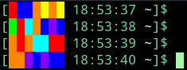
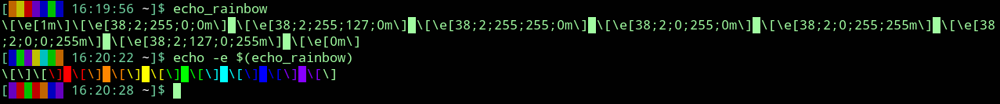
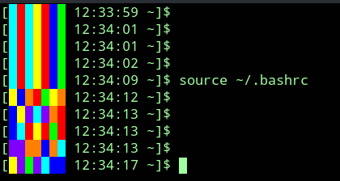

# what
Cool little things to include in your Bash PS1 prompt

### echo_rainbow.sh
Vanilla rainbow


### echo_rainbow_edge_fade.sh
Faded rainbow


### echo_randbow.sh
Random rainbow :game_die:



See if you get any cool patterns! ... Or an ultra rare ***single color***...

7 blocks and 7 possible colors means there's a `7 / 7^7`, or 0.00085%, chance of getting all 7 of any color, which seems about 1,489 times more likely than [winning the lottery](https://www.huffpost.com/entry/chances-of-winning-powerball-lottery_b_3288129).

(Considering I've never gotten that once over several months at time of writing of seeing at least a few dozen prompts per day, I feel discouraged from ever buying Powerball tickets.)

# how
Copy the functions in the .sh files into `~/.bashrc`.

Alternatively (and preferably), put the .sh files themselves somewhere and then symlink them in a directory that's in `$PATH` (e.g., `/usr/local/bin/`) without the ".sh" extension, like this:

```bash
ln -s /somewhere/echo_rainbow.sh /usr/local/bin/echo_rainbow
```

Now, `echo_rainbow.sh` can be called in the shell with `echo_rainbow` (or whatever you named the symlink).

Then just call it in the PS1 definition in `~/.bashrc`:

```bash
# [███████ HH:MM:SS short_pwd]$
PS1="[$(echo_rainbow) \t \W]$ "
```

Due to Bash's messy color syntax for the braces and things, I like to import the color definitions from `color_defs.sh` (also symlinked in `$PATH` as `color_defs`) and define the PS1 like this:

```bash
source color_defs
LEFT_BRACE="\[$ANSI_BOLD_GREEN\][" # [
TRINKET="$(echo_rainbow)"
TIME_PART="\[$ANSI_BOLD_GREEN\]\t" # HH:MM:SS
PWD_PART="\[$ANSI_BOLD_LGRAY\]\W" # short pwd
RIGHT_BRACE="\[$ANSI_BOLD_GREEN\]]" # ]
PROMPT_PART="$\[$ANSI_RESET\]" # $

PS1="${LEFT_BRACE}${TRINKET} ${TIME_PART} ${PWD_PART}${RIGHT_BRACE}${PROMPT_PART} "
```

You can get more subdued colors with `light`, `medium`, or `dark` args (e.g., `echo_rainbow dark`).

Note that the color codes (ANSI escape sequences) and surrounding syntax won't work too well *outside* of the PS1 prompt declaration:



:exclamation: Finally, to get dynamic trinkets (like `echo_randbow`) to update with each prompt line, put this under the PS1 definition in `~/.bashrc`:

```bash
# Re-source .bashrc with every prompt to refresh dynamic $TRINKETs
PROMPT_COMMAND='source $HOME/.bashrc'
# WARNING: This will have the small side-effect of preventing Python
# virtual environments from decorating the prompt with "(venv dir)"
# (but the virtual environments will still work).
# Also, obviously, saving .bashrc in a broken state will make that
# breakage apparent at the next prompt since it'll be immediately re-sourced.
```

And then re-source `.bashrc` in any currently-open shells for the trinket to start updating:



:game_die::rainbow:
